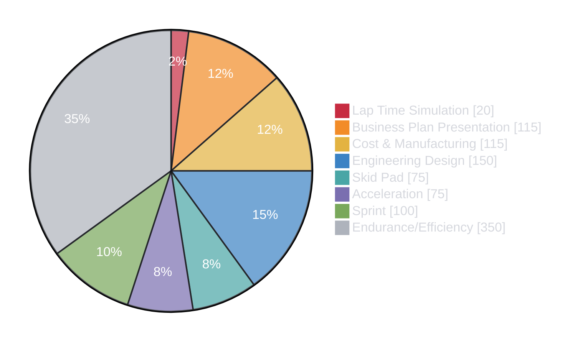

# Competition Overview

Formula Trinity competes in [Formula Student UK](https://www.imeche.org/events/formula-student), where university teams develop a single-seater race car and defend the engineering behind it. The competition is not simply about building the fastest car: teams are assessed on their design process, manufacturing and cost decisions, technical understanding, safety, reliability and on-track performance.

The competition begins before the team arrives. Reports and forms must be submitted, the car must be completed and ideally tested, and team members must be ready to explain their work. At the event, the team presents its engineering in the **static events**, passes every stage of **scrutineering** (*hopefully*), and only then takes part in the **dynamic events**.

## At a Glance

| Stage | What happens | Why it matters |
| --- | --- | --- |
| **Pre-event preparation** | Complete and test the car, submit the required documents and practise judging. | Late or incomplete work affects every part of the competition. |
| [**Static Events**](statics/index.md) | Judges assess the team's design, cost, manufacturing and business decisions. | Strong results require clear explanations, sound evidence and global vehicle knowledge. |
| [**Scrutineering**](scrut/index.md) | The car progresses through Technical, Safety, Chassis, Tilt, Noise and Brakes inspections. | All stages must be passed before the car is allowed on track. |
| [**Dynamic Events**](dynamics/index.md) | The car competes in Skid Pad, Acceleration, Sprint and Endurance/Efficiency. | These events reward performance, driveability and reliability. |

## Explore This Section

- [**Design Judging**](statics/design/index.md) — Vehicle goals, design decisions, trade-offs and validation.
- [**Cost & Manufacturing**](statics/cost/index.md) — Cost-report submissions and the in-person judging process.
- [**Scrutineering**](scrut/index.md) — Preparation, inspections and lessons learned from FTX7.
- [**Dynamic Events**](dynamics/index.md) — The four on-track events and the route to competing in them.

This guidance is written for the IC team and includes lessons from FTX7. Always use it alongside the current competition rules.

## Points Breakdown

The 1,000 available points are split between:

- **Static events:** 400 points
- **Dynamic events:** 600 points

Static events account for 40% of the total score, so documentation, engineering understanding and the team's ability to justify its work are a major part of the competition.

*Business Presentation and Lap Time Simulation are included in the chart for context, although they are not currently covered in detail by this wiki section.*

---

## A Typical Competition Week

The exact timetable changes each year, and judging slots are allocated to individual teams, but the week generally follows this pattern:

| Day | Typical activities |
| --- | --- |
| **Wednesday** | Unload into the paddock and attend the opening ceremony. Prepare the car and documentation for the days ahead. |
| **Thursday–Friday** | Design, Cost & Manufacturing and Business Plan judging take place. Scrutineering runs alongside the static events, with teams returning to the pits to resolve any issues. Cars that pass may also have access to practice running. |
| **Saturday** | Acceleration, Skid Pad and Sprint take place, alongside static-event finals and the first awards ceremony. |
| **Sunday** | Endurance and Efficiency take place, followed by the final awards ceremony. |

Scrutineering remains the priority until every stage is passed: missing the dynamic-event cut-off means missing the opportunity to score. Always check the [official event timetable](https://www.imeche.org/events/formula-student/team-information/event-timetable) and [current rules](https://www.imeche.org/events/formula-student/team-information/rules), as event days and opening times may change.
