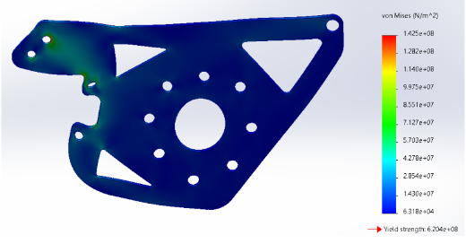
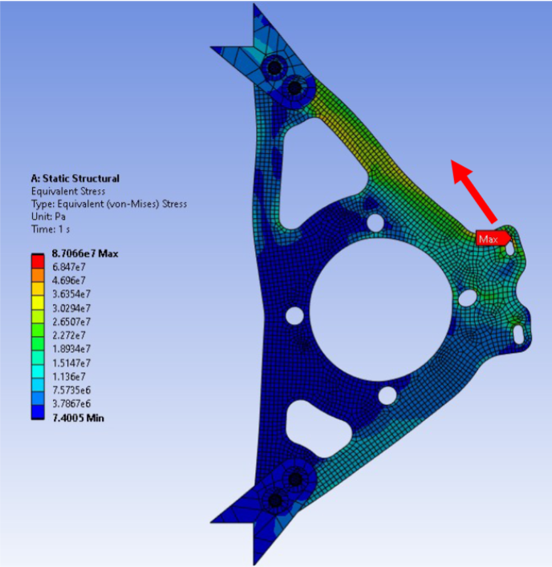

# Drivetrain Mounts

## FTX-7 Mount Design Choices

The FTX-7 drivetrain mounts were CNC cut from 3.0 mm mild steel plate.

For the right-hand mount, the main additional design requirement was mounting the brake caliper. The maximum braking force was calculated using a deliberately conservative rear brake bias. In reality, most of the braking force is reacted through the front axle due to longitudinal load transfer under braking.

The tangential force at the brake disc can be calculated from:

$$
F_{\text{brake}} = \frac{T_{\text{brake}}}{r_{\text{disc}}}
$$

where:

- $F_{\text{brake}}$ = tangential force at the brake disc
- $T_{\text{brake}}$ = braking torque
- $r_{\text{disc}}$ = effective brake disc radius

This force can then be used to check the main failure modes around the caliper mounting points:

- Bolt shear
- Bearing failure at the bolt holes
- Edge tear-out / shear-out
- Sufficient material around the mounting holes

### Chain Load and Bearing Reactions

For the mount without the brake caliper, the main load comes from the spool bearing. Chain tension acting on the driven sprocket produces a radial load on the spool, which is reacted through the two spool bearings and into the drivetrain mounts.

The  chain force can be estimated from the torque at the driven sprocket:

$$
F_{\text{chain}} = \frac{T_{\text{sprocket}}}{r_{\text{sprocket}}}
$$

where:

- $F_{\text{chain}}$ = effective chain force
- $T_{\text{sprocket}}$ = torque at the driven sprocket
- $r_{\text{sprocket}}$ = sprocket pitch radius

The torque transmitted by the chain is produced by the difference between the tight-side and slack-side chain tensions:

$$
T_{\text{sprocket}} =
(F_{\text{tight}} - F_{\text{slack}})
r_{\text{sprocket}}
$$

### Bearing Reactions

The spool can be treated as a beam supported by its two bearings. The reaction at each bearing depends on the position of the sprocket relative to the bearing centres.

For a sprocket positioned between the two bearings:

$$
R_L + R_R = F_{\text{chain}}
$$

Taking moments about the left bearing:

$$
R_R L = F_{\text{chain}} a
$$

$$
R_R = F_{\text{chain}}\frac{a}{L}
$$

$$
R_L = F_{\text{chain}}\frac{L-a}{L}
$$

where:

- $R_L$ = reaction at the left bearing
- $R_R$ = reaction at the right bearing
- $L$ = distance between bearing centres
- $a$ = distance from the left bearing to the sprocket load

A shear force diagram (SFD) is a useful way of checking these reactions. The resulting bearing loads can then be applied to the drivetrain mounts for hand calculations and FEA.

### Spool Bending

A bending moment diagram (BMD) should also be produced for the spool to find the maximum bending moment and where it occurs.

The resulting bending stress can be calculated using:

$$
\sigma_b = \frac{My}{I}
$$

where:

- $\sigma_b$ = bending stress
- $M$ = bending moment
- $y$ = distance from the neutral axis to the outer surface
- $I$ = second moment of area

The sprocket should be kept as close as practical to its nearest bearing. Increasing this distance increases the bending moment in the spool, while reducing it helps limit spool deflection and maintain drivetrain alignment.

## What Could Be Improved

A lot of the FTX-7 mount geometry was dictated by the existing engine and chassis packaging rather than being designed around the cleanest possible load path.

In particular, mounting the drivetrain from the engine created indirect load paths between the spool bearings and the chassis. This meant more material was needed to achieve the required stiffness and strength, resulting in relatively heavy mounts.

*FTX-7 drivetrain mount FEA. The geometry results in a relatively indirect load path between the bearing and mounting points.*

The FTX-6 mount is a useful comparison. Its geometry provides a much more direct load path between the bearing and its mounting points.

*FTX-6 drivetrain mount FEA, showing a shorter and more direct load path.*

FEA was used on FTX-7 to identify low-stress regions and remove unnecessary material. However, there is a limit to how much weight can be removed from a poor underlying layout. For future designs, the load path should be improved first and FEA should then be used to optimise the geometry.

There may also be scope to use thinner steel for future mounts. This should not be decided based on stress alone, as mount stiffness is also important. Excessive deflection at the spool bearings could cause sprocket and chain misalignment even if the mount remains below yield.

FEA should therefore be used to check both maximum stress and displacement at the bearing locations under the critical drivetrain load cases.

### Engine-Mounted Drivetrain

Mounting the drivetrain directly from the engine should be avoided in future designs. It caused several problems on FTX-7:

- **Poor serviceability:** Removing the engine also meant removing the drivetrain assembly, adding a significant amount of work during maintenance.

- **Poor repeatability:** After removing and reinstalling the engine, it did not always return to exactly the same position.

- **Mounting-hole misalignment:** Small changes in engine position changed the position of the drivetrain mounts, which made the mounting holes difficult to align during reassembly.

- **Drivetrain alignment:** Changes in engine and drivetrain position made it harder to maintain consistent sprocket and chain alignment.

- **Inefficient load paths:** Bearing and chain loads had to pass through the drivetrain mounts and engine mounting structure before reaching the chassis instead of being reacted directly into the chassis.

For future cars, the drivetrain should be supported directly from defined chassis hard points rather than from the engine. The engine and drivetrain should also be independently removable so that removing one does not disturb the position or alignment of the other.

A good starting point would be to mount the drivetrain between the upper and lower tubes of the rear bulkhead. This would provide much shorter load paths from the spool bearings into the chassis and should allow the mounts to be made lighter and stiffer.
