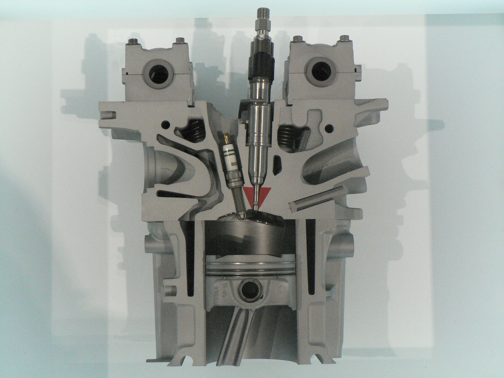

# Fuel Injection

*Figure 1: A cutaway model of a petrol direct-injected engine.*

**This document covers general information on fuel injection, the fuel-injection process, and the type of fuel injection used in the FTX-7 car. For further information related to fuel injection, please use the Navigation list below.**

## Navigation

- [How a Fuel Injector Works](./fuel_injector/fuel-injector.md)
- [Injection Timing](./injection_timing/injection-timing.md)
- [Types of Fuel Injection](./injection-system_types/injection-system-types.md)
- [Injector Flow Rate](./injector_flow_rate/Injector-Flow-Rate.md)

## General Information

Fuel injection is the process of introducing fuel into an internal combustion engine using one or more fuel injectors.

All compression-ignition engines, such as diesel engines, and many spark-ignition engines, such as petrol engines, use some form of fuel injection. Fuel injection largely replaced carburettors by the early 1990s.

The primary difference between carburetion and fuel injection is how the fuel enters the airflow:

- **Fuel injection** atomises fuel by forcing it through a small nozzle under pressure.
- **Carburetion** uses suction created by air flowing through a Venturi tube to draw fuel into the airstream.

Mixture-formation systems can be divided into two main categories:

- **External mixture formation:** Air and fuel are mixed outside the combustion chamber. This is generally known as manifold injection.
- **Internal mixture formation:** Fuel is injected directly into the combustion chamber.

Manifold injection can be further divided into multi-point injection, also known as port injection, and single-point injection, also known as throttle-body injection.

The term **electronic fuel injection (EFI)** refers to any fuel-injection system controlled electronically by an engine control unit (ECU).

## Fuel-Injection Process

A fuel-injection system must perform three main functions:

1. Pressurise the fuel
2. Meter the required quantity of fuel
3. Inject the fuel into the engine

### Pressurising the Fuel

Fuel injection requires pressurised fuel. A fuel pump supplies the pressure needed to force the fuel through the injectors and atomise it into small droplets.

### Metering the Fuel

The system must determine the appropriate quantity of fuel to supply and control its delivery.

Early mechanical injection systems used injection pumps that both pressurised and metered the fuel. Since the 1980s, electronic systems have increasingly been used to control fuel metering.

In a modern system, the ECU calculates the required fuel quantity and controls functions such as:

- Injector timing
- Injection duration
- Ignition timing
- Air–fuel ratio
- Other engine-management functions

### Injecting the Fuel

A fuel injector is an electronically or mechanically controlled spray nozzle that represents the final stage of the fuel-delivery system.

Depending on the injection system, the injector may be located:

- Inside the combustion chamber
- In the intake port or inlet manifold
- In the throttle body

## FTX-7 "Bruce"

### Fuel-Injection Configuration

FTX-7 uses an engine from a 2003 Honda CBR600RR. The engine originally used Honda's dual-stage programmed fuel-injection system, which is commonly found in high-performance motorcycles.

For FTX-7, the original system was modified to use port injection with one injector per cylinder.