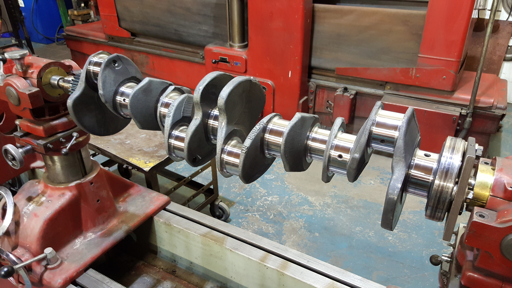

# Injection Timing

### Engine-Position Sensing

To determine the correct injection timing, the ECU must know:

- The engine speed
- The crankshaft position
- The current stage of the four-stroke cycle

#### Crankshaft Sensor

*Figure 4: Crankshaft.*

The ECU uses a variable-reluctance (VR) sensor positioned near the crankshaft. This sensor detects the teeth of a rotating trigger wheel, allowing the ECU to calculate the crankshaft angle and engine speed.

#### Camshaft Sensor

The crankshaft completes two revolutions during each four-stroke engine cycle. Crankshaft position alone therefore does not identify which stroke a cylinder is currently completing.

A second VR sensor positioned near the camshaft provides a cylinder-phase reference. This allows the ECU to determine the current stroke of cylinder 1 and operate the injectors at the correct point in the engine cycle.

*Further information about the crankshaft and camshaft sensors is available on the relevant sensor pages of this wiki.*